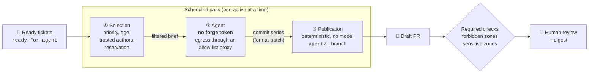

# night-shift

**Your ready tickets move forward overnight. In the morning, you review draft PRs instead of babysitting agents.**

[](https://github.com/UnPoilTefal/night-shift/actions/workflows/ci.yml)
[](https://scorecard.dev/viewer/?uri=github.com/UnPoilTefal/night-shift)
[](https://github.com/UnPoilTefal?tab=packages&repo_name=night-shift)
[](go.mod)
[](LICENSE)
[](https://github.com/UnPoilTefal/night-shift/issues/1)
[](#roadmap)
[](docs/adr/)
[](GLOSSARY.md)

night-shift runs scheduled **passes** of AI coding agents over the **ready tickets** in an issue tracker: issues labelled `ready-for-agent` and carrying a self-contained agent brief. Each pass reserves a capped number of tickets and hands each one to a headless agent, locked in a container that has no privileges. It produces exactly two things: **draft PRs** and a **digest** for human review.

This project does not bet on the model behaving. **Everything the agent must not do is enforced by a deterministic mechanism.**

## How it works



1. **Selection**: the pass walks the queue (priority, then age, skipping blocked tickets), keeps only content written by trusted authors, and **reserves** the tickets it takes.
2. **Agent**: a container that receives a filtered brief and a clone of the repository. It holds **no forge token** and can only reach DNS and an egress proxy with a domain allow-list. It returns a series of commits, nothing more.
3. **Publication**: a step with no model involved. It applies the series, pushes an `agent/…` branch with an attribution trailer and opens a **draft** PR. It never merges and never pushes a tag. It then follows the PR's CI: if checks fail, the pass relaunches the agent **once**, in a fresh container on a fresh clone of the published branch, with the names and excerpts of the failing checks. There is never a third round.
4. **Required checks**: on the forge side, a PR that touches a **forbidden zone** (CI, release pipeline, agent configuration) fails, and a PR that touches a **sensitive zone** (dependencies, for instance) is flagged so that a human decides.

## Security principles

An agent treats whatever it reads as instructions, and a ticket may carry a prompt injection. night-shift therefore never combines **untrusted content**, **write access** and **network or secret access** at the same time (the *lethal trifecta*).

| Risk | Deterministic guardrail | Decision |
|---|---|---|
| The agent edits CI, the release pipeline or its own configuration | Required CI check on **forbidden zones** | [ADR 0002](docs/adr/0002-frontiere-deterministe.md) |
| A token leaks through prompt injection | The agent container **holds no token**: only Publication pushes | [ADR 0005](docs/adr/0005-agent-sans-droit-d-ecriture.md) |
| Exfiltration, access to the internal network | Egress closed by default, allow-list proxy | [ADR 0002](docs/adr/0002-frontiere-deterministe.md) |
| A third party gives orders through a comment | Brief built from trusted authors only; a third-party comment hands the ticket back to a human | [ADR 0002](docs/adr/0002-frontiere-deterministe.md) |
| Two agents on the same ticket | Serialized passes and reservation | [ADR 0001](docs/adr/0001-passes-planifiees-serialisees.md) |
| The agent merges or approves | Service identity holds a strict subset of the team's rights | [ADR 0003](docs/adr/0003-identite-sous-ensemble-des-droits.md) |

### What the agent reads

The pass, not the agent, builds the brief, and the agent never reads the ticket itself. An author is trusted when the forge associates them with the repository (owner, member, collaborator) or when the opt-in lists them under `trustedAuthors`.

- The brief holds the title and body when the ticket's author is trusted, then every trusted comment, in order, except night-shift's own reports. Anything else is dropped before it reaches the agent's container.
- The brief dates from its latest trusted content. If a third party wrote or edited a comment since then, or if no content is trusted at all, the ticket is not processed: it moves from `ready-for-agent` to `needs-triage`, with a comment that explains why without ever quoting the untrusted content. A human decides whether the brief must change, then puts the ticket back in `ready-for-agent`.
- No ticket content is ever interpolated into a shell command: the brief reaches `claude -p` on its standard input, and the title only becomes a branch slug restricted to `[a-z0-9-]`.

A repository is opened to passes only through an **opt-in** (*Adhésion*): a file versioned in the repository itself and protected as a forbidden zone. The repository must also be able to enforce required checks.

## Three tiers

| Tier | What changes | For whom |
|---|---|---|
| **Solo** | A Kubernetes `CronJob`: one pod in steps (selection, agent, publication, then one agent retry if CI fails) | A maintainer and their repositories |
| **Team** | One service account per team, trust levels per repository | A team that owns its repositories |
| **Platform** | A self-service **Kubernetes operator**: a team declares a **Shift** (*Poste*) in its namespace | A platform team offering night-shift to others |

A repository's **trust level** (*palier de confiance*: tickets per pass, draft or ready PRs) is raised only by a human decision, based on **outcomes** measured on the forge.

## Roadmap

Status: **a pass runs a real headless `claude -p` agent on a brief built from trusted authors only, opens a draft PR, follows its CI with at most two agent rounds, and ends with a digest; images are published on each release. Outcomes and the weekly digest come next.**

**Solo tier** ([spec](https://github.com/UnPoilTefal/night-shift/issues/2))

- [x] Go foundation, CI and required checks ([#3](https://github.com/UnPoilTefal/night-shift/issues/3))
- [x] Minimal pass: selection and reservation, with a stubbed harness ([#4](https://github.com/UnPoilTefal/night-shift/issues/4))
- [x] Zone check: verdict on a PR diff, usable from any repository's CI ([#5](https://github.com/UnPoilTefal/night-shift/issues/5))
- [x] Real `claude -p` harness, with publication of a draft PR ([#6](https://github.com/UnPoilTefal/night-shift/issues/6))
- [x] Trusted-author filtering: a third-party comment after the brief sends the ticket back to triage ([#7](https://github.com/UnPoilTefal/night-shift/issues/7))
- [x] Container images: a generic base and a Go layer, published on each release ([#11](https://github.com/UnPoilTefal/night-shift/issues/11))
- [x] Pass digest: a summary comment per ticket, a digest issue per opted-in repository, a short Discord notification ([#8](https://github.com/UnPoilTefal/night-shift/issues/8))
- [x] CI rounds: the pass follows the draft PR's CI and relaunches the agent once on failing checks, never a third time ([#9](https://github.com/UnPoilTefal/night-shift/issues/9))
- [ ] Outcomes and weekly digest ([#10](https://github.com/UnPoilTefal/night-shift/issues/10))

**GitLab pilot** ([spec](https://github.com/UnPoilTefal/night-shift/issues/57))

- [ ] Ticket source and code forge as two separate contracts, with one contract test suite for every adapter
- [ ] Publication enforces the zones before pushing, so the opt-in file becomes the only thing a target repository needs ([ADR 0011](docs/adr/0011-publication-frontiere-des-zones.md))
- [ ] GitLab adapter: issues as a ticket source, draft merge requests, pipelines for CI rounds, self-managed instances

**Platform tier** ([spec](https://github.com/UnPoilTefal/night-shift/issues/12))

- [x] Increment 0: `Shift` and `Pass` custom resources, a scheduled pass per cron occurrence, one active pass per shift, a hardened orchestrator Job ([#13](https://github.com/UnPoilTefal/night-shift/issues/13))
- [ ] Increments 1 to 9, from a fake ticket source and one Job per ticket up to an agent with context, harness and tools ([#14](https://github.com/UnPoilTefal/night-shift/issues/14) to [#22](https://github.com/UnPoilTefal/night-shift/issues/22))

## Development

The binary runs a **pass** in steps, one per container, and provides the **zone check**, which an opted-in repository can run as a required check: see [`docs/opt-in.md`](docs/opt-in.md) for the opt-in schema and the GitHub Action.

```sh
go build -o night-shift ./cmd/night-shift
./night-shift version     # "dev" unless injected with -ldflags
./night-shift zones --base origin/main --head HEAD --head-ref agent/42-fix-typo
make test                 # unit and envtest suites
make lint
```

A pass hands its work from one step to the next through two shared directories: `--state` (the reserved task, written by `select` only) and `--work` (the clone and the agent's output).

```sh
# 1. Selection (forge token): reserve the top ready ticket, clone the target repository.
NIGHT_SHIFT_GITHUB_TOKEN=… ./night-shift select --repo owner/repo --state /state --work /work

# 2. Agent (no forge token; refuses to start if one is present): run /implement through claude -p.
#    --auth subscription reads CLAUDE_CODE_OAUTH_TOKEN, --auth api-key reads ANTHROPIC_API_KEY.
CLAUDE_CODE_OAUTH_TOKEN=… ./night-shift agent --state /state --work /work --timeout 30m

# 3. Publication (forge token, no model): apply the commit series on agent/<n>-<slug>,
#    push it, open a draft PR and wait for its CI (--ci-timeout, 10m by default). The verdict waits
#    until every check has stayed completed for --ci-settle (1m), so a slow workflow is not missed.
#    Green: hand the ticket back in an explicit state, then publish the digest.
#    Red: prepare the retry in /state2 and /work2 instead (fresh clone of the branch, failing checks).
#    NIGHT_SHIFT_DISCORD_WEBHOOK is optional.
NIGHT_SHIFT_GITHUB_TOKEN=… NIGHT_SHIFT_DISCORD_WEBHOOK=… ./night-shift publish --state /state --work /work \
  --next-state /state2 --next-work /work2

# 4. Retry (no forge token): the agent adds fixing commits on top of the published branch.
#    With no retry prepared, it does nothing.
CLAUDE_CODE_OAUTH_TOKEN=… ./night-shift agent --state /state2 --work /work2 --timeout 30m

# 5. Retry publication: push on the same PR, wait for CI, hand the ticket back and publish the digest.
#    With no retry prepared, the first publication already did, and it does nothing.
NIGHT_SHIFT_GITHUB_TOKEN=… ./night-shift publish --follow-up --state /state2 --work /work2
```

The forge token needs read and write access to contents, pull requests and issues, and read access to checks and commit statuses. It is never mounted in the agent's container, in either round.

| Agent outcome | Ticket ends up |
|---|---|
| Commits, CI green (first or second round) | Linked to a **draft** PR, commit messages kept, `Night-Shift-Agent` and `Night-Shift-Pass` trailers added; no lifecycle label left |
| Commits, CI not settled before `--ci-timeout` | Same, with a mention of the checks still running |
| Commits, CI still red after the second round | `ready-for-human`; the PR stays a draft, with a comment that sums up the failing checks |
| Brief not enough, unmet precondition, unnamed dependency | `needs-info`, with the agent's reason |
| Failure, timeout, crash | `ready-for-human`, with a mention of the interruption |

Each ticket gets a summary comment: what was done, cost, duration and its provisional **outcome**. The pass then ends with its **digest**:

- **Digest issue**: one per repository the pass walked, even when its queue was empty, and the issue says so. It lists the processed tickets by number, with provisional outcome, draft PR, duration and cost, plus the tickets sent back to triage, the pass duration and the agents' cost. A repository left out (no opt-in, invalid opt-in) or unreachable never gets one.
- **What stays inside**: anything that does not concern a repository never leaves the cluster: which repositories were left out and why, and the details of incidents. Today they live in the logs of the pass's pods, and the example `CronJob` keeps a week of Jobs so that recent passes stay inspectable. An in-cluster view of past passes is planned for the platform tier ([#51](https://github.com/UnPoilTefal/night-shift/issues/51)).
- **Incidents**: if part of the pass fails (a reservation, a clone), `select` records it instead of exiting, so the pod still reaches publication. The digest counts the incidents without their details, then `publish` exits with an error so that the job shows the failure.
- **Discord notification** (optional): it holds only counters (tickets, triage, incidents, repositories left out or unreachable) and links to the digest issues; it never names a repository left out, never carries an error message or ticket content, and mentions nobody. The egress proxy must let `publish` reach `discord.com`. Without a webhook, the pass still succeeds and the digest says the notification is not configured. If the webhook fails, the digest issues get a comment saying so.

[`examples/solo/cronjob.yaml`](examples/solo/cronjob.yaml) shows the expected deployment: a `CronJob` whose pod runs `select`, `agent`, `publish` and `retry-agent` as init containers and `retry-publish` as its container, with the forge token and the Discord webhook mounted only in the trusted steps. Its deadline (90 minutes) covers two agent rounds of 30 minutes and two CI waits of 10 minutes. A test in the repository keeps it that way. The egress proxy and transcript retention belong to your deployment. `./night-shift pass` still runs selection and hand-back in a single process with a stubbed agent, which is handy for trying an opt-in.

### Container images

Two images, built from [`images/`](images/) with [`docker-bake.hcl`](docker-bake.hcl):

| Image | Contents | Used by |
|---|---|---|
| `ghcr.io/unpoiltefal/night-shift` | `night-shift`, Claude Code, `gh`, `git`, `make`, and the [mattpocock skills](https://github.com/mattpocock/skills) | `select` and both `publish` steps, and as the base of a repository's tool image |
| `ghcr.io/unpoiltefal/night-shift-go` | The base image plus the Go toolchain | Both `agent` steps, for Go repositories |

- Both run as a non-root user (UID 65532) and carry no secret: tokens and webhooks are provided at run time. They work on a read-only root filesystem once `HOME` points to a writable directory, such as an `emptyDir` on `/tmp`, as the example `CronJob` does.
- The skills are installed as Claude Code managed skills (`/etc/claude-code/.claude/skills`), so `HOME` and `CLAUDE_CONFIG_DIR` set by the deployment never hide `/implement`.
- Every pull request builds both images, smoke-tests them (tools, injected version, non-root user, skills) and scans them for secrets. A `vX.Y.Z` tag publishes them for `linux/amd64` and `linux/arm64`, tagged `X.Y.Z`. CI then smoke-tests and scans the pushed images on both platforms, and only then moves `latest` (never for a pre-release such as `v1.0.0-rc.1`). The first release, `v0.1.0`, is out.
- Renovate tracks the base images, Claude Code, `gh` and the skills.

```sh
docker run --rm ghcr.io/unpoiltefal/night-shift-go:0.1.0 night-shift version
make images test-images scan-images          # or build them locally, tagged dev
```

A repository's tool image derives from either one: `FROM ghcr.io/unpoiltefal/night-shift:<version>`, then its own toolchain.

### Operator preview

A team declares a **Shift** (*poste*) in its namespace; the operator turns each cron occurrence into a **Pass** (*passe*) and each pass into an orchestrator Job. At this stage the Job is a placeholder that only prints the pass name, but it already runs under the `restricted` pod security standard.

```yaml
apiVersion: nightshift.unpoiltefal.github.io/v1alpha1
kind: Shift
metadata:
  name: team-tickets
spec:
  trigger:
    schedule: {cron: "0 2 * * *", timeZone: Europe/Paris}
  mission:
    tickets:
      source:
        fake: {configMapName: tickets-demo}
```

Try it on a throwaway [kind](https://kind.sigs.k8s.io/) cluster. It uses its own kubeconfig (`bin/kind.kubeconfig`), never your current context:

```sh
make kind-up kind-deploy kind-samples
KUBECONFIG=bin/kind.kubeconfig kubectl -n night-shift-demo get shifts,passes,jobs
make kind-down
```

`make test-e2e` runs the same scenario end to end in CI.

Every pull request runs lint, tests, the image build with its smoke test and secret scan, and the kind end-to-end scenario. Lint, tests and images are required checks on `main`.

## Documentation

Design documents are written in French, using the glossary's French aliases.

- [`docs/opt-in.md`](docs/opt-in.md): the opt-in schema and how to wire the zone check into a repository's CI.
- [`GLOSSARY.md`](GLOSSARY.md): the glossary. Every term in **bold** in this README is defined there under its canonical English name, with its French alias (shown here in *italics*) used throughout the French design documents.
- [`docs/adr/`](docs/adr/): architecture decisions, including the alternatives that were rejected.
- [`docs/agents/`](docs/agents/): configuration for the agents working on this repository.

## Security

See [`SECURITY.md`](SECURITY.md) to report a vulnerability privately.

## License

[MIT](LICENSE)
