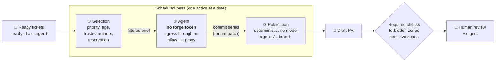

# night-shift

**Your ready tickets move forward overnight. In the morning, you review draft PRs instead of babysitting agents.**

[](https://github.com/UnPoilTefal/night-shift/actions/workflows/ci.yml)
[](https://scorecard.dev/viewer/?uri=github.com/UnPoilTefal/night-shift)
[](go.mod)
[](LICENSE)
[](https://github.com/UnPoilTefal/night-shift/issues/1)
[](#roadmap)
[](docs/adr/)
[](CONTEXT.md)

night-shift runs scheduled **passes** of AI coding agents over the **ready tickets** in an issue tracker: issues labelled `ready-for-agent` and carrying a self-contained agent brief. Each pass reserves a capped number of tickets and hands each one to a headless agent, locked in a container that has no privileges. It produces exactly two things: **draft PRs** and a **digest** for human review.

This project does not bet on the model behaving. **Everything the agent must not do is enforced by a deterministic mechanism.**

## How it works



1. **Selection**: the pass walks the queue (priority, then age, skipping blocked tickets), keeps only content written by trusted authors, and **reserves** the tickets it takes.
2. **Agent**: a container that receives a filtered brief and a clone of the repository. It holds **no forge token** and can only reach DNS and an egress proxy with a domain allow-list. It returns a series of commits, nothing more.
3. **Publication**: a step with no model involved. It applies the series, pushes an `agent/…` branch with an attribution trailer and opens a **draft** PR. It never merges and never pushes a tag.
4. **Required checks**: on the forge side, a PR that touches a **forbidden zone** (CI, release pipeline, agent configuration) fails, and a PR that touches a **sensitive zone** (dependencies, for instance) is flagged so that a human decides.

## Security principles

An agent treats whatever it reads as instructions, and a ticket may carry a prompt injection. night-shift therefore never combines **untrusted content**, **write access** and **network or secret access** at the same time (the *lethal trifecta*).

| Risk | Deterministic guardrail | Decision |
|---|---|---|
| The agent edits CI, the release pipeline or its own configuration | Required CI check on **forbidden zones** | [ADR 0002](docs/adr/0002-frontiere-deterministe.md) |
| A token leaks through prompt injection | The agent container **holds no token**: only Publication pushes | [ADR 0005](docs/adr/0005-agent-sans-droit-d-ecriture.md) |
| Exfiltration, access to the internal network | Egress closed by default, allow-list proxy | [ADR 0002](docs/adr/0002-frontiere-deterministe.md) |
| A third party gives orders through a comment | Brief built from trusted authors only; a third-party comment hands the ticket back to a human | [ADR 0002](docs/adr/0002-frontiere-deterministe.md) |
| Two agents on the same ticket | Serialized passes and reservation | [ADR 0001](docs/adr/0001-passes-planifiees-serialisees.md) |
| The agent merges or approves | Service identity holds a strict subset of the team's rights | [ADR 0003](docs/adr/0003-identite-sous-ensemble-des-droits.md) |

A repository is opened to passes only through an **opt-in** (*Adhésion*): a file versioned in the repository itself and protected as a forbidden zone. The repository must also be able to enforce required checks.

## Three tiers

| Tier | What changes | For whom |
|---|---|---|
| **Solo** | A Kubernetes `CronJob`: one pod in three steps (selection, agent, publication) | A maintainer and their repositories |
| **Team** | One service account per team, trust levels per repository | A team that owns its repositories |
| **Platform** | A self-service **Kubernetes operator**: a team declares a **Shift** (*Poste*) in its namespace | A platform team offering night-shift to others |

A repository's **trust level** (*palier de confiance*: tickets per pass, draft or ready PRs) is raised only by a human decision, based on **outcomes** measured on the forge.

## Roadmap

Status: **the pass selects, reserves and hands back real tickets; no agent is plugged in yet.**

**Solo tier** ([spec](https://github.com/UnPoilTefal/night-shift/issues/2))

- [x] Go foundation, CI and required checks ([#3](https://github.com/UnPoilTefal/night-shift/issues/3))
- [x] Minimal pass: selection and reservation, with a stubbed harness ([#4](https://github.com/UnPoilTefal/night-shift/issues/4))
- [x] Zone check: verdict on a PR diff, usable from any repository's CI ([#5](https://github.com/UnPoilTefal/night-shift/issues/5))
- [ ] Real `claude -p` harness, with publication of a draft PR ([#6](https://github.com/UnPoilTefal/night-shift/issues/6))
- [ ] Trusted-author filtering, digest, CI rounds, outcomes, container images ([#7](https://github.com/UnPoilTefal/night-shift/issues/7) to [#11](https://github.com/UnPoilTefal/night-shift/issues/11))

**Platform tier** ([spec](https://github.com/UnPoilTefal/night-shift/issues/12))

- [ ] The Kubernetes operator in ten increments, from mocked plumbing (a hello-world container) up to an agent with context, harness and tools ([#13](https://github.com/UnPoilTefal/night-shift/issues/13) to [#22](https://github.com/UnPoilTefal/night-shift/issues/22))

## Development

There is nothing to deploy yet. The binary already runs a **minimal pass** (selection, reservation, hand-back to a human, with a stubbed agent) and provides the **zone check**, which an opted-in repository can run as a required check: see [`docs/opt-in.md`](docs/opt-in.md) for the opt-in schema and the GitHub Action.

```sh
go build -o night-shift ./cmd/night-shift
./night-shift version     # "dev" unless injected with -ldflags
./night-shift zones --base origin/main --head HEAD --head-ref agent/42-fix-typo
NIGHT_SHIFT_GITHUB_TOKEN=… ./night-shift pass --repo owner/repo   # repositories without an opt-in are skipped
go test -race ./...
golangci-lint run ./...
```

Every pull request runs the same lint and tests in CI. Both are required checks on `main`.

## Documentation

Design documents are written in French, using the glossary's French aliases.

- [`docs/opt-in.md`](docs/opt-in.md): the opt-in schema and how to wire the zone check into a repository's CI.
- [`CONTEXT.md`](CONTEXT.md): the glossary. Every term in **bold** in this README is defined there under its canonical English name, with its French alias (shown here in *italics*) used throughout the French design documents.
- [`docs/adr/`](docs/adr/): architecture decisions, including the alternatives that were rejected.
- [`docs/agents/`](docs/agents/): configuration for the agents working on this repository.

## Security

See [`SECURITY.md`](SECURITY.md) to report a vulnerability privately.

## License

[MIT](LICENSE)
